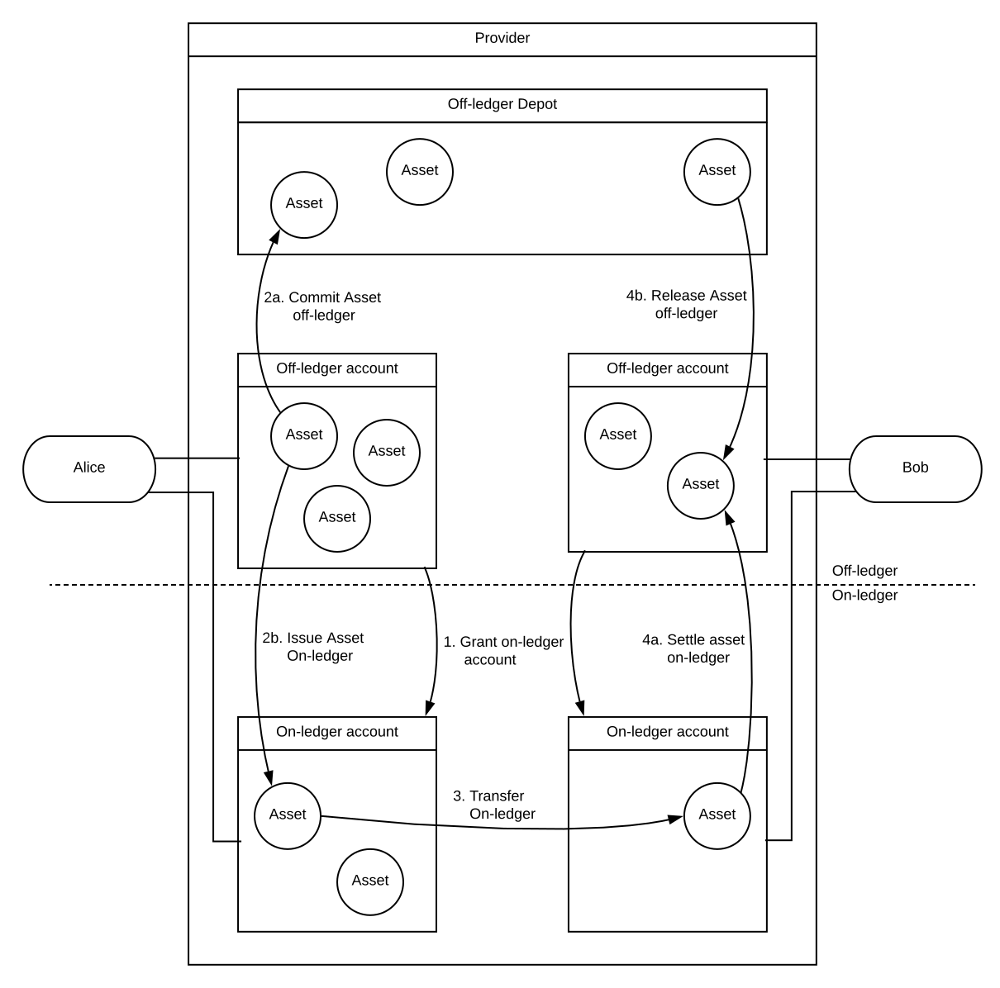
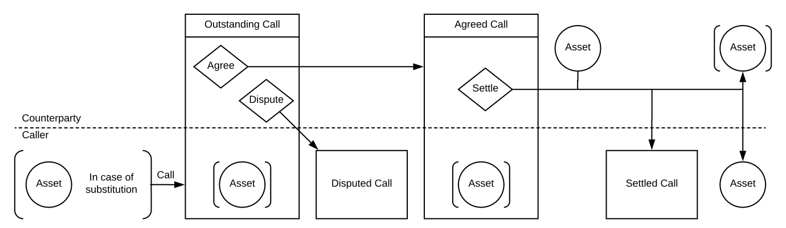
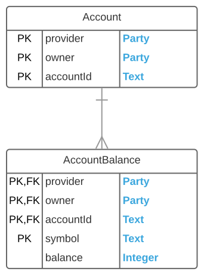
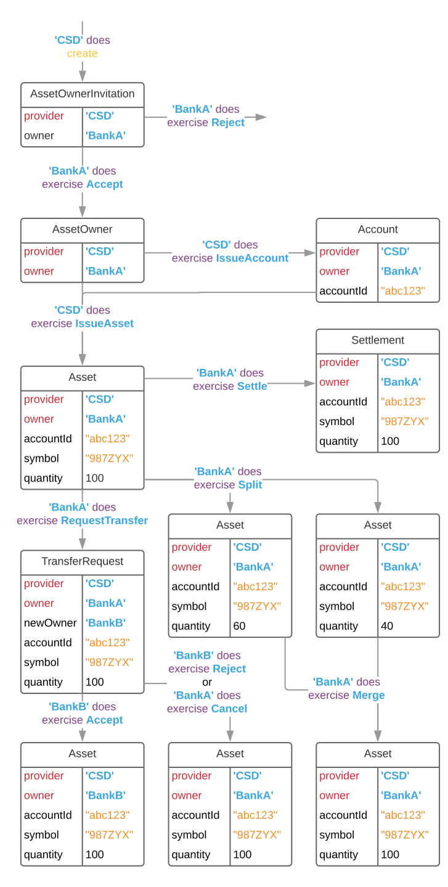
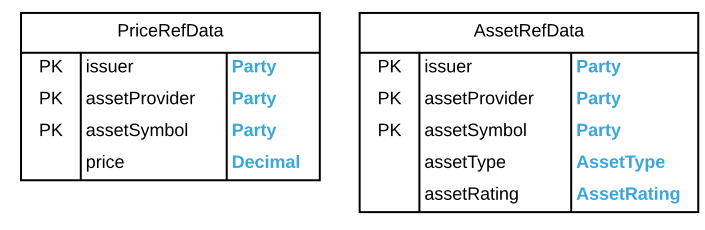
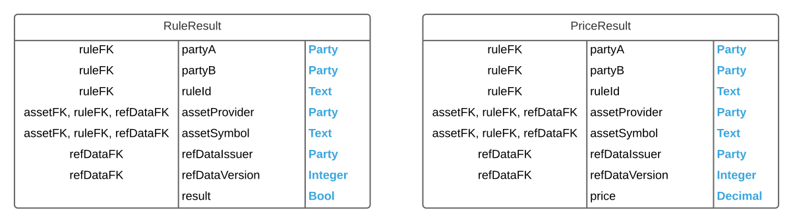

<!-- Copyright (c) 2020, Digital Asset (Switzerland) GmbH and/or its affiliates. All rights reserved.-->
<!-- SPDX-License-Identifier: Apache-2.0-->

# DAML Example: Collateral Management

This example demonstrates how the collateral management process can be modeled in DAML.

- [Introduction to collateral management](#introduction-to-collateral-management) provides background on a few functions of the complex topic of collateral management
- [A simple model](#a-simple-model) delineates which parts of the processes are modeled
- [DAML implementation](#daml-implementation) explains the key design decisions behind the DAML model
- [Sample workflow](#sample-workflow) gives a brief overview of the included test script

Special emphasis is put on **composability**, **reference data**, **settling compound transactions atomically**, different **ways of thinking about contracts on the ledger**, and the **maintenance of an operational state**, which allows for easy integration with external systems.

## Introduction to Collateral Management

*Collateral* is used widely across the financial markets to manage various types of risk. It represents the group of assets pledged or transferred to a counterparty as part of a financial transaction to protect one party against another.

An example of a type of trade requiring the exchange of collateral is a repurchase agreement (or *repo*), in which a *dealer* (also known as the *borrower* or *collateral provider*) sells or lends securities to an *investor* (also known as the *lender* or *collateral receiver*) that buys or receives the securities and agrees to sell or deliver them back at a later date. The money used to buy the securities can be considered as "borrowed” money, and the securities for which the cash is exchanged is the *collateral*. If the dealer does not buy back the securities on the agreed upon date, the securities (or collateral) are now the property of the investor. In this scenario, collateral is used to mitigate the cash lending risk of the investor.

While repo is one type of financial transaction requiring the exchange of collateral, there are many other types of trades, including derivatives, that require the exchange of collateral based on the underlying value of the trade. As the value of the securities rises and falls throughout the lifecycle of the trade, more collateral may need to be *delivered* to fulfill the full value of the obligation or collateral may be *returned* based on the movement of the market. The collateral provider parties may also decide to *substitute* different securities for the already posted collateral. In many cases, it is not only the change in value of the collateral that leads to further deliveries and returns, but also other types of risk defined in the eligibility schedule between the counterparties (i.e., securities credit risk, segment risk, concentration risk, securities index risk, etc.).

Transactions that require the posting of collateral are often governed by a *collateral agreement* between the counterparties. Collateral agreements are typically bilateral or triparty (where an agent is involved) contracts that determine, amongst other terms, the types and amounts of assets that are *eligible* as collateral, the frequency of collateral valuations, the process by which collateral is valued, and how often collateral is transferred. Two counterparties may have multiple collateral agreements governing their various underlying transactions.

The portion of the collateral agreement that contains the types and amounts of assets that are eligible as collateral is known as the *eligibility schedule*. The eligibility schedule describes what assets may be posted as collateral, how their fair market value has to be adjusted to calculate their value as collateral, and how much of one particular asset may be used as collateral. One common way to specify the conversion from market value to collateral value is using a *discount* (also known as *haircut*), which is a percentage that is deducted from the market value of a security to adjust for its assumed risk exposure. For example, a U.S. government bond (also known as a U.S. Treasury) with a AA+ rating may be eligible with a low haircut given the perceived stability of the U.S. government as an issuer, but a corporate bond with rating A or above might have a haircut of 10% and only constitute at most 50% of the total obligation. Facts like market price or rating are taken from specified third parties. Such external information is collectively called *reference data*.

Collateral is often exchanged on a daily basis. The parties or their agreed upon collateral agent determine the value of collateral that needs to be posted by evaluating the risk of the underlying trade(s). This value or obligation can be referred to as the *margin* or *Required Value (RQV)* depending on the underlying trade type, and represents either *Initial Margin* (IM) or *Variation Margin* (VM).

To determine the value of the daily obligation, the parties compare the new obligation against the previous day’s obligation, and determine the amount of collateral that needs to be exchanged, either in the form of a delivery or a return. The counterparty is informed about the required transfer of collateral via a *margin call* or RQV (nomenclature dependent on the underlying trade type) that reflects the obligation. If the amount is agreed, it becomes legally binding, and a transfer of assets is instructed and settled later in the business day. Such a transfer can either take the form of a true *title transfer*, in which case the counterparty takes full control over the delivered assets or it can involve a *pledge* of the assets held at a custodian as collateral for the repo buyer. Traditionally, the substitution of collateral that has already been pledged or transferred is facilitated by over-delivering eligible collateral and, in turn, returning previously pledged or transferred collateral once the delivery is settled. Since transfers and settlements are not instant, and delivery and return cannot be settled atomically, the party is over collateralized during a substitution.

In some cases, the two parties involved in the underlying trade may disagree on the obligation amount. This is known as a dispute, and may be, among other reasons, due to the fact that the parties are using different pricing methodologies. The parties may reconcile this dispute immediately if the different is not materially different, or they may follow dispute protocols as set forth in the collateral agreement.

## A simple model

The model is based on two concepts: off-ledger accounts and assets and on-ledger accounts and assets.

Participants have off-ledger accounts with providers. Off-ledger assets in these accounts can be converted to on-ledger assets and vice versa.
On-ledger assets are simple *agreements* in which a provider promises an owner to transfer, on demand, the corresponding security off-ledger. The off-ledger accounts are mirrored by on-ledger accounts to keep track of who has an account with who and facilitate the issuance and settlement of assets. On-ledger assets are fully fungible and transferable between parties with accounts at the same issuer.

### Simple asset holding

The terminology used in this example model was chosen to be as descriptive as possible of the workflows involved, and is a mixture of the nomenclatures used in bilateral repo and derivatives trading. The party called *borrower* is the one with an obligation to the *lender* and requests for deliveries, returns, or substitutions of assets are made via a call.

A collateral agreement specifies how the fair market value (or *price*) of an asset is determined, as well as which assets are eligible in terms of their classification and rating. To enter into such an agreement, the lender proposes the agreement to the borrower, who may either accept or reject the proposal.

### Sample collateral agreement

| Collateral Agreement |
|----------------------|
| Price Agreement      |
| Eligibility Criteria |

| **Classification** | **Rating** | **Haircut** |
|--------------------|------------|-------------|
| Bond               | >AA+       | 2%          |
| Equities           | >A         | 5%          |

Only asset price, classification, and rating are available as reference data on the ledger in this example. Any party is able to publish these attributes, so lender and borrower must agree on the providers of reference data as part of the collateral agreement. Issuers of reference data are able to change the values, for example, to update the rating or price of an asset. Any checks of market value or eligibility by borrower or ledger have to be made against the most up to date reference data.

The lender can make delivery calls to the borrower, and the borrower can make return and substitution calls to the lender under the agreement. The calls can either be agreed or disputed by the receiver, but note that disputes are not covered in this model beyond being indicated on the ledger. Agreed calls can be settled by pledging or transferring an eligible asset. The following rules govern the call types:

- **Delivery**
  
  An asset can only be used to settle an obligation if it can be shown to be eligible under the collateral agreement and valuable enough to meet the required value of the obligation.
- **Return**
  
  The asset used to settle the return call must match the one specified on the return call.
- **Substitution**
  
  A substitution of collateral must be pre-allocated with an eligible asset under the collateral agreement at the time the call is made. Both assets are exchanged atomically at the time of settlement.

Disputed and settled obligations remain on the ledger until the caller archives them.

### Margin call

Choices are indicated by diamonds, stakeholders / owners by position above or below the dashed line.

Each collateral agreement has an associated collateral schedule on the ledger that keeps track of the total assets currently pledged or transferred under the agreement.

## DAML implementation

DAML modules should be designed in a composable fashion so that adding more functionality will not require modification of already existing functionality. It is easy to add new templates to an already running ledger application, but modifying existing templates requires all parties on the ledger to agree to an upgrade.

In this example, four main concerns build up on top of each other:

1. [Asset holding](#asset-holding)
2. [Reference data](#reference-data)
3. [Agreeing on complex facts](#agreeing-on-complex-facts)
4. [Collateral agreements](#collateral-agreements)

Templates should be kept as independent from each other as possible. DAML does not support circular dependencies between modules so too much interdependence between templates results in unwieldy modules.

### Asset holding

It is worth looking at the asset holding model presented in [Simple asset holding](#simple-asset-holding) in a few different ways.

#### Relational database

Looking at it from the perspective of relational databases, there are two types of entities that need to be stored on the ledger -- accounts and account balances:

Primary and foreign key constraints are not enforced automatically in DAML. The uniqueness constraints on primary keys are difficult to realize so it is advisable to build models that do not require them. In this example, duplicate account tokens simply replicate the link between off- and on-ledger accounts and are therefore not a problem. Duplicate balances represent pieces of the overall balance. They are therefore not stored as account balances, but as `Asset` tokens, which can be managed via `Split` and `Merge` choices. The foreign key constraint has to be enforced through choices. Asset holding is set up in such a way that the provider can only issue assets to an existing account and transfers can only be accepted with reference to the target account.

[See lines 34, 38, 42, 44-46 of daml/AssetHolding.daml](daml/AssetHolding.daml).

[See lines 34, 38, 42, 44-46 62, 71, 75-78 of daml/Asset.daml](daml/Asset.daml).

> **Note:** A malicious provider and owner could extend the DAML model with further contracts that do allow them to create `Asset` contracts without a corresponding account. This would technically break the foreign key constraint that the model is trying to enforce, but both provider and owner have to agree to this explicitly, so there is no danger to other ledger participants.

#### Contracts and obligations

At first glance, only the provider appears to be in an obligable position. Unless the on-ledger owner of an asset settles it, there are no off-ledger consequences. The provider could therefore be the sole `signatory` of `Account` and `Asset` contracts, with owners merely appearing as controllers of choices. This would not be in the spirit of DAML. DAML contracts are designed to represent real legal agreements digitally, and the issuance and settlement mechanisms merely provide a workable interface to off-ledger financial infrastructure. Thus, the `Asset` contract should not only capture the provider's obligation to convert from on-ledger to off-ledger assets, but also the owners assumption of responsibility for a held asset.

#### Workflows

It is important to consider the model in terms of workflows. When a new asset holder joins the ledger, new `Asset` and `Account` contracts need to be created. They each require two signatures, so they have to be created through a choice. It would be possible to manage this through intermediate `IssuanceRequest` contracts, but that would be cumbersome and make it difficult to ensure that all assets are associated to an existing account. It would also be possible to only issue `Account` contracts that way and then issue `Asset` contracts via an `Issue` choice on `Account`. This would work, but create a circular dependency between `Account`, `Asset` and `TransferRequest` that would require all templates to reside in one module. An easy way to circumvent such problems is the use of a *role contract* as demonstrated in this example. New asset holders are on-boarded through an `AssetOwnerInvitation`, and all issuance is managed through the `AssetOwner` role contract. This way, `Account` is a pure token without any choices, thus avoiding any circularities.

One more important design choice worth highlighting is how asset transfers work. If `TransferRequest` had a reference back to the `ContractId Asset` of the asset that is to be transferred, the asset would stay with the sender as an `Asset` until the receiver accepts the transfer. The downside of that model is that the sender could execute another choice between sending the `TransferRequest` and the receiver accepting it, in which case the transfer fails. One could say that the transfer request has gone stale. To avoid race conditions of this kind, the `Asset` is consumed by the `RequestTransfer` choice in this example, and a new `Asset` is created upon acceptance, cancellation or rejection. There is a trade-off, which is that the `Asset` is consumed by the `TransferRequest`. If a party wanted to keep  track of their holdings, they would now have to combine information from `Asset` and `TransferRequest` contracts.

> **Note:** There is another reasonable option, which is to do transfers in three steps.

    1. The sender requests a transfer via a non-consuming choice on an asset. The request only contains the value of the asset, not the reference.
    2. The receiver accepts or declines.
    3. The sender settles the transfer by supplying the asset contract.

  This scheme still does not fully solve the problem of stale transfers. A sender could initiate multiple transfers from one asset, but not have the assets to settle them all. This is not as bad, as we end up with choices that cannot be executed due to missing inputs rather than failing choices, but it is no silver bullet for the issue described above.

The result of all these considerations is the following data, signatory and workflow schema. Signatories are highlighted in red. The DAML implementation of the below is found in files `Asset.daml` and `Account.daml`:

Possible workflows in the simple asset holding model. Note that the the issuance and use of BankB's account has not been shown.

### Reference data

Reference data is represented by simple single-signatory contracts. Anyone can issue such data, so it is up to consumers to agree on which reference data is acceptable. Section [Agreeing on complex facts](#agreeing-on-complex-facts) shows how to reach such agreements. The same considerations as for asset holding apply.

In terms of data, reference data is very simple:

All DAML contracts are as private as possible by default, meaning only the issuer can see a piece of reference data. The issuer therefore needs a way to *publish* their contract to other parties. This can either be done by setting an observer or by divulging the contract via choice. The latter has the disadvantage that divulgence is not preserved when the reference data is updated, and parties that can see the contract through divulgence are not considered stakeholders and do not get notified of any changes. The use of observers is therefore preferable in almost all cases and used in this example.

[See lines 10-12, 17-20 of daml/RefData.daml](daml/RefData.daml).

The only possible workflows on reference data are updates and invalidation, which is simply a removal from the ledger. While they are simple choices to implement, they have considerable impact on how the workflows in [Agreeing on complex facts](#agreeing-on-complex-facts) and [Collateral agreements](#collateral-agreements) work. The purpose of reference data is for other parties to come to agreement on some facts. If the reference data issuer updates the value, any agreements based upon the old value should be voided or otherwise indicate that they are based on an outdated reference data contract. Any attempted use of such agreements should fail gracefully. One way to stop use of outdated agreements is to reference the `ContractId` of the reference data used. However, DAML has no try-catch blocks, so the transaction will fail when `fetch` is called on the reference data. It would be difficult to distinguish outdated from otherwise invalid agreements and impossible to fail gracefully. A better solution, showcased in this example, is to version reference data. [Agreeing on complex facts](#agreeing-on-complex-facts) explains how this allows for graceful failure or helpful error messages.

[See lines 10, 18, 22-29 of daml/RefData.daml](daml/RefData.daml).

### Agreeing on complex facts

Based on published reference data, agreeing on facts like asset classification and rating is easy in principle as it boils down to a reference to the provider and value of the respective reference data contract. An eligibility rule like "The asset is a Equity with rating at least A by 'RatingAgency'", can be expressed in a function `ContractId Asset -> ContractId AssetRefDataCid -> Update Bool`:

[See lines 93-107 of daml/Eligibility.daml](daml/Eligibility.daml).

Functions are not valid field types for templates. To store the above function as an eligibility criterion on a collateral agreement contract, it would be necessary to make it part of the template, thereby destroying the generic nature of the agreement. Every possible eligibility schedule would require its own template. It is also not possible to evaluate functions specified in the DAML model outside of transactions. Maintaining a state table of agreed facts like asset eligibilities would require reimplementation of logic off-ledger, which is highly undesirable.

Both of these issues are solved by encapsulating the above function in an `AEquityRule` template that evaluates it and stores the evaluation arguments and result in a `RuleResult`. This provides a relatively uniform output. Many different `Rule` templates can all generate `RuleResult` contracts as output that allows their consumption by the collateral agreement without fixing what kind of rule was applied. It is also possible to keep an overview of all currently agreed or agreeable facts by making sure there is a valid `RuleResult` contract for each `Rule` on the ledger.

[See lines 74-89 of daml/Facts.daml](daml/Facts.daml).

The `RuleResult` contract above is determined by the signature of the function `ContractId Asset -> ContractId AssetRefDataCid -> Update Bool` for which it stores the evaluation result. To agree on price, we need a function `ContractId Asset -> ContractId PriceRefDataCid -> Update Decimal` so the rule how to agree on price has to return a `PriceResult` rather than a `RuleResult`.

> **Note:** For more complex applications, it is possible to implement a single kind of `RefData` contract that stores its payload in a key-value store. Instead of taking a single ref-data contract, the rules (and results) could be adapted to take lists. The type of the result contract for the evaluation of some function on an asset and some reference data then only depends on the return type of the function, which means that only few different types or result have to be dealt with.

  One could further reduce the number of templates required by keeping rules very simple and combining them through some kind of algebra like propositional calculus. Rather than having one template for "Type = Bond And Rating = AAA Or Rating = AA Or Rating = A", we would have one template for equality comparison and a way to combine them with "And" and "Or" operators.

From a relational databases perspective, there are two entity types for facts: `RuleResult` for boolean facts on assets and `PriceResult` for decimal ones. Facts are always established bilaterally in the model, meaning that all rules and results have two parties and signatories on them. Rules are identified by a field `ruleId`. It is left to the two parties to ensure that there is no double-use of identifiers.

The contracts perspective does not add much to the considerations. The rules and agreed facts need the signatures of both parties and both parties are obligable in the sense that the other party can use the rule to establish a fact and can use that fact in other workflows.

The key issue with the workflow was already touched upon in [Reference data](#reference-data). Parties to a fact need to be able to check its ongoing validity. Since reference data is versioned, this is accomplished by providing the most up-to-date reference data to the result and checking whether the version has changed.

[See lines 9, 22-40 of daml/Facts.daml](daml/Facts.daml).

> **Note:** There is no provision for rules to be changed or archived, so the ongoing existence of a rule does not need to be checked in the `Check` choice of the results.

For the purpose of this example, three rules are provided:

- `AAABondRule`
  
  A rule to check that an asset is a AAA bond
- `AEquityRule`

  A rule to check that an asset is an equity with rating >=A. It is easy to see how the :ref:`example-ca-function-aEquity` is encapsulated in the template `AEquityRule`.
  
  [See lines 165-202 of daml/Rules.daml](daml/Rules.daml).
- `RefDataPriceRule`

  A rule to establish a price based on a given provider's reference data.

> **Note:** The ratings `AAA`, `AA` and `A`, and the asset type `Bond` are hard-coded in this example. The model would gain some genericity if ratings and types were parameterized on the template. The evaluation result is decoupled from any consumers via the `RuleResult` contract, so this would not require changes elsewhere in the model.

### Collateral agreements

With rules and facts modeled as they are, the collateral agreement pictured in [Sample collateral agreement](#sample-collateral-agreement) is easy to model by referencing a `ruleId` for a pricing agreement and a `ruleId` together with a haircut for each eligibility criterion.

[See lines 7-10 of daml/Eligibility.daml](daml/Eligibility.daml).

[See lines 15-24 of daml/CollateralAgreement.daml](daml/CollateralAgreement.daml).

The eligibility of an asset under a collateral agreement is agreed bilaterally through a process similar to that for rule or price results. It is modeled the same way. Instead of a `Rule` generating a `RuleResult`, the collateral agreement itself generates an `EligibilityProof`, taking the `RuleResult` and `AssetRefData` contracts for each `EligibilityCriterion` as inputs. The `EligibilityProof` contracts keep track of which eligibility criteria are applicable to which assets and the effective haircut for each asset. As with the rules, this model allows a participant to keep all the information about eligibility on-ledger in a uniform way. In this example, if multiple criteria are applicable, the minimum haircut is applicable.

[See lines 79-88 of daml/CollateralAgreement.daml](daml/CollateralAgreement.daml).

[See lines 17-34 of daml/Eligibility.daml](daml/Eligibility.daml).

The data model and workflow of the process shown in [Margin call](#margin-call) need some thought. Recall that there are three types of call - Delivery, Return, and Substitution - and four states of a call - Outstanding, Disputed, Agreed, and Settled. The possible actions on each of the 12 possible type / state combinations might be different, but creating 12 contract templates would make maintenance of the model expensive and it would be more difficult to get an overview of all calls. This example therefore only implements one `Call` template which keeps track of both type and state, checking for transition validity in the choices.

[See lines 11-25, 45, 119-129 of daml/Call.daml](daml/call.daml).

Calls are made through non-consuming choices on the collateral agreement contract and then advanced from state to state through choices on the call itself. The eligibility check is performed when the request for a substitution is made or upon settlement for deliveries.

The collateral schedule, which keeps track of the pledged or transferred collateral, can be considered the *state* of the collateral agreement. Since only this state and not the agreement itself changes when collateral is pledged, transferred or returned, it makes sense to keep it in a separate contract of type `CollateralAgreementState`. This state is created together with the `CollateralAgreement` contract from a `CollateralAgreementProposal` and has to be supplied in any of the `Settle` choices on `Call`.

> **Note:** To avoid an intermediate state-change request for every update to the schedule, we allow the borrower to remove tracked collateral, effectively gifting them to the lender. The lender can add tracked collateral, gifting them to the borrower. In a full-fledged collateral management application, this type of unilateral state-change would not be permitted.

## Sample workflow

`Test.daml` includes a script for a complete workflow using the templates created in this example.
